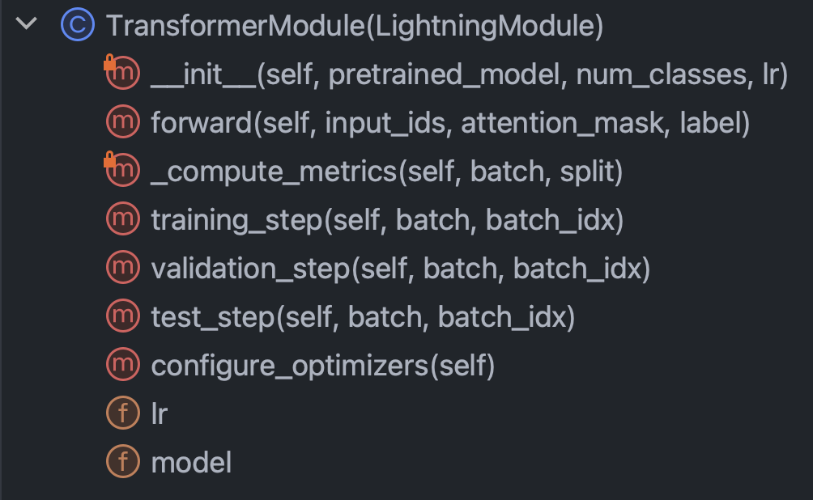

# 🔥 Build Your Custom AI/LLM With PyTorch Lightning

## Introduction

Processes and information are at the heart of every business. The vulnerability and
opportunity of this moment is the question of whether your business can automate your
processes using AI, and reap the rewards of doing so. ChatGPT, a general purpose AI, has
opened our eyes to what AI can do. What matters now is directing the power of AI to *your*
business problems and unlocking the value of *your* proprietary data. In this document, I 
will
show you how.

## Table of Contents

1. [Overview of LLM Fine Tuning](#1-overview-of-llm-fine-tuning)
2. [Problem Background](#2-problem-background)
3. [Architecture of the AI System](#3-architecture-of-the-ai-system)
4. [Code Deep Dive](#4-code-deep-dive)
5. [Model Results](#5-model-results)
6. [Installation and Quick Start](#6-installation-and-quick-start)
7. [Contribute](#7-contribute)
8. [References](#8-references)

## 1. Overview of LLM Fine Tuning

You don't want an AI that just can chat; what you really want are automations that perform
the work that keeps your business running--powering through business processes at
great accuracy and scale. The proven way to customize AI to your business
processes is to fine tune an LLM on your data and on the action you want AI to perform.

Let's talk specifically about the fine tuning that we are going to do in this document
and the technology behind it. Listed below are the five tools we will use extensively:

- **PyTorch Lightning** (gives us just enough control without excessive boilerplate)
- **Hugging Face** (access to thousands of community-maintained models)
- **Polars** (this data manipulation library is orders of magnitude faster than pandas
  and is
  really trending now)
- **MLflow** (for tracking results during the process of fine tuning)
- **Azure ML** (we could've also gone with AWS SageMaker, but the user experience of
  Azure ML
  felt better)

At the end of the day, you should take away two things from this document:

- How to build deep learning models that attain state-of-the-art results
- How the experience of building such models can be pretty easy when your mentality is
  to build small, modular, and reusable components (something that PyTorch Lightning
  facilitates)

I'm going to describe to you a hard, real-world problem, what machine learning
researchers have already done, and the new frontier we have been able to push to using
powerful, SOTA tools. We're going to train models on GPUs in the cloud. We're also going
to put powerful MLOps practices into action--using MLflow to organize our experiments
and parameters. And along the way, I'm going to point out the design pattern of this
project so that you can customize the codebase for your own deep learning projects.

Let's start with the problem background.

## 2. Problem Background

A good process for finding suitable problems for machine learning and for quality datasets
is to start by browsing sites with benchmarks. Benchmarks provide a frame of reference
for the level of difficulty of the problem for machine learning, which we use to measure
our progress during model development. One particular dataset with well established
benchmarks is
the [Unfair Terms of Service dataset (UNFAIR-ToS)](https://huggingface.co/datasets/lex_glue/viewer/unfair_tos);
here's an intriguing
problem statement for it: Use AI to find all unfair clauses in Terms of Service
contracts. The context is that the European consumer law on unfair contracts establishes
what unfair clauses are and the different types of unfair clauses. What makes UNFAIR-ToS
perfect for text classification is that it has been manually labeled in accordance with
that which was set down in the European law.

Chalkidis et al. (2021) applied eight different machine learning methods to UNFAIR-ToS
and obtained macro F1 ranging from 75 to 83, and in Figure 1 just below, we excerpt from
their published results.

#### Figure 1

| Method       | UNFAIR-ToS |          |
|--------------|------------|----------|
|              | micro F1   | macro F1 |
| TFIDF-SVM    | 94.7       | 75.0     |
| BERT         | 95.6       | 81.3     |
| RoBERTa      | 95.2       | 79.2     |
| DeBERTa      | 95.5       | 80.3     |
| Longformer   | 95.5       | 80.9     |
| BigBird      | 95.7       | 81.3     |
| Legal-BERT   | 96.0       | 83.0     |
| CaseLaw-BERT | 96.0       | 82.3     |

Interesting things we can infer from this table are:

1. F1, not accuracy, is the authors' preferred metric
2. macro F1 is a better differentiator than micro F1
3. all the deep learning models exhibit similar performance while SVM is materially worse

Looking at the data, class imbalance is certainly present, which is a good reason for the
first and second point above.

There are eight different types of unfair clauses. The authors of that paper developed
multi-label classification models for the eight types, but we are simply going to
build a binary classification model that classifies a clause as fair or unfair.

Let's design how we're going to do it.

## 3. Architecture of the AI System

#### Figure 2


## 4. Code Deep Dive

### 📝 Some Conventions to Know

* Functions are categorized as either helper functions or APIs. Python's single underscore
  protected notation is used here to tag a function as a helper function.
* `__init__.py` exposes the public APIs of the module it is in so that we can conveniently
  shorten imports for deeply submoduled functionality like this example:

```python
from .fine_tune_clsify_head import TransformerModule
```

The above import in `architectures/__init__.py` enables code outside `architectures` to
import `TransformerModule` without having to remember the breadcrumbs leading to where this
function sits, like this:

```python
from architectures import TransformerModule
```

### 🚶 A Tour of the Project

Here's what the project structure looks like from the root of the lightning_mlflow module:

```
.
├── architectures
│   ├── __init__.py
│   └── fine_tune_clsify_head.py
├── config
│   ├── __init__.py
│   └── train_config.py
├── data
│   ├── __init__.py
│   └── lex_glue.py
└── train.py
```

The key question is why the project is structured this way. And the answer is that
separation of concerns is established between the 3 submodules and 1 entrypoint. Let's
walk through each one of these modules in turn:

* `architectures`: specifies essentially everything PyTorch needs to know except for
  the data
* `config`: holds all the parameters and can be subdivided into `train_config.py` and
  `inference_config.py` and whatever else
* `data`: holds all the data processing logic and settings
* `train.py`: the central point of control; this is the only piece of code that can see
  `architectures`, `config`, and `data`; MLflow sdk calls go here

With this brief intro out of the way, let's roll up our sleeves and try to really
understand the code in each of the modules. Let's start with
[architectures/fine_tune_clsify_head.py](https://github.com/zjohn77/lightning-mlflow-hf/blob/70db3818f1fb8496a6f433eb0922519d21c1f33b/lightning_mlflow/architectures/fine_tune_clsify_head.py#L3).
This code is organized like Figure 3 just
below.

#### Figure 3




It's clear that the key methods inside this class to understand are: the constructor,
the forward pass through the network, the metrics, and the steps. We'll discuss each of
these in turn. Let's start with the constructor. This snippet is what the code looks like:

#### Figure 4


What's really crucial here is that the constructor loads a pretrained model from
Hugging Face, and sets up Parameter Efficient Fine Tuning (PEFT). PEFT is the bleeding
edge way to fine tune Large Language Models, and is a Hugging Face implementation of
QLoRA, which is the combination of three different efficiency strategies: quantization,
low rank, and adapter. Quantization is the idea that a single-byte integer is of
sufficient numerical precision for gradient computations in deep learning. Low rank
comes from the linear algebra concept that the rank of a matrix is the number of
non-redundant dimensions of the vector space. Adapter tuning can be understood as a sort
of generalization of tuning the head of the network, by refitting a portion of the
weights in many layers.

Let's look at the `forward` method:

#### Figure 5


As training a neural network involves the alternation between backprop and feed forward,
this specifies the forward part, and the notable thing is that the arguments of
`forward` are: `input_ids`, `attention_mask`, and `label`. These are the outputs of a
Hugging Face tokenizer, and they allow us to tie together Hugging Face and PyTorch Lightning.

Next, let's take a look at the `_compute_metrics` method:

#### Figure 6


There are a few things worth noting here. First, observe how the logits are unpacked
from the forward function evaluation and then converted to probabilities via softmax
function. This, in turn, leads to the binary prediction. We use the prediction and the
actual (`batch["label"]`) to calculate the accuracy, F1, precision, and recall.

Finally, let's talk about `training_step`, `validation_step`, and `test_step`.

#### Figure 6


They look almost alike, with an important difference being `training_step` returning
`outputs["loss"]` instead of `metrics`. This makes sense because backprop is iteratively
minimizing loss; `training_step` is just PyTorch Lightning's abstraction of the training
loop.

OK, now we're done with `architectures`, let's dive into [config/train_config.py](https://github.com/zjohn77/lightning-mlflow-hf/blob/70db3818f1fb8496a6f433eb0922519d21c1f33b/lightning_mlflow/config/train_config.py#L4),
which looks like Figure 7 below.

#### Figure 7


This code is self-explanatory, but there are some choices to call out. The
`pretrained_model` is set to `roberta-base`, and if we were to change it to any
Hugging Face model name that supports AutoTokenizer, everything should still work (tested)
. Model accuracy was found to be most sensitive to `max_length` and `batch_size`, so
these are the main hyperparameters to play around with, and they both tradeoff
between accuracy and computational load. On Azure ML, I used the Standard_NC24ads_A100_v4
instance. The vRAM on the A100 GPU proved to be the limiting factor for these two
hyperparameters. What I found was that 256 was the largest `batch_size` that wouldn't
cause CUDA to throw an out-of-memory error.

Determining `max_length` of 128 was easier since the vast majority of clauses were under
this token limit.

Finally, as we will see later, `max_epochs` of 10 was chosen by trial and error as the
validation F1 metric we were tracking in MLflow was flattening by that point.

OK, let's talk about data. Everything you need to know is in the `LexGlueDataModule`
class
in [data/lex_glue.py](https://github.com/zjohn77/lightning-mlflow-hf/blob/70db3818f1fb8496a6f433eb0922519d21c1f33b/lightning_mlflow/data/lex_glue.py#L3),
and this is its structure:

#### Figure 8


There are quite a few nitty-gritty details in `LexGlueDataModule`, but the main idea is
that the `setup` method fetches the data directly from Hugging Face, and then some sort
of tokenization has to happen. The details of that tokenization is in the
`_shared_transform` method, which is just the high level interface for the
`_preprocess` callback method.

Finally, we're ready
for [train.py](https://github.com/zjohn77/lightning-mlflow-hf/blob/70db3818f1fb8496a6f433eb0922519d21c1f33b/lightning_mlflow/train.py#L3),
the central point of control for everything.
Remember when we began this section with the directory structure of the project? That
structure is communicating an important message: that dependencies are resolved
downwards in the directory tree. In other words, we restricted code to only calling
other code that's on the same level or lower. This restriction certainly does not come
from Python; it's self-imposed, and why? To eliminate guesswork. There's no question
that confusing dependency chains are a major problem in large codebases. What all of
this means is that `train.py` is going to import the functionality from each of the other
modules and then set into motion a training run. Let's look at the piece of code at the
heart of it:

#### Figure 9


We're instantiating a PyTorch Lightning Trainer class, turning on early stopping, and 
setting the precision based on the machine we're on via `precision="bf16-mixed" if torch.
cuda.is_available() else "32-true"`. We configure MLflow to track everything. To put
everything together, we import the functionality from the other three modules we had 
described earlier:

```python
from architectures.fine_tune_clsify_head import TransformerModule
from config import TrainConfig
from data import LexGlueDataModule
```

The core functionalities are wrapped in our subclasses of PyTorch Lightning superclasses,
and so we instantiate them:

```python
model = TransformerModule(
    pretrained_model=config.pretrained_model, num_classes=config.num_classes,
    lr=config.lr, )
datamodule = LexGlueDataModule(
    pretrained_model=config.pretrained_model, max_length=config.max_length,
    batch_size=config.batch_size, num_workers=config.num_workers,
    debug_mode_sample=config.debug_mode_sample, )
```

And finally, we invoke the `fit` and `test` methods of the `trainer` object:

```python
trainer.fit(model=model, datamodule=datamodule)
best_model_path = checkpoint_callback.best_model_path

# Evaluate the last and the best models on the test sample.
trainer.test(model=model, datamodule=datamodule)
trainer.test(
    model=model, datamodule=datamodule, ckpt_path=best_model_path, )
```

We had called `test` twice so that we are testing both the last model at stop time and the
best model according to our metric. This is a perfect example of the rich functionality
that comes with PyTorch Lightning.

And that wraps up the code walkthrough. Now let's dive into the model results.

## 5. Model Results

Here's a dashboard that puts it all together:

#### Figure 10


Taking advantage of the tight integration between Azure and MLflow, the metrics from our
training run have been made available for easy consumption and visualization in the
Azure ML web console. MLflow captured way more than just the metrics, but going deeper
into its full functionality and the broader use cases of MLOps is for another day. For
now, let's focus on the story that our data visualization reveals to us.

One thing that pops out from the top left chart is that training has no doubt improved
loss on the validation sample. Furthermore, between 125 and 190 steps, the curve starts to
flatten, a potential indication that further training could be unnecessary. But being
monotonic, we see that overfitting has not yet occurred, and what's more, the curve
steepened again from 190 to 210, so perhaps we should've let it run for another 5 epochs.

The top right plot, interestingly, tell a similar story. The most notable characteristic
is how high the accuracy values are, and the unit here is percentage. That the lines
are hitting 90% from the get-go makes sense because the dataset is unbalanced at 1:9
ratio between unfair and fair. It's exactly why the preferred metric is F1, which is
what we display in the bottom left graph.

The F1 curves here exhibit the classic pattern where model improves rapidly at first but
eventually reaches the point of diminishing return. An interesting question provoked by
the F1 curves is how do we reconcile between the loss and F1, when one suggests tapering
while the other leaves room for going further? The following bit of theory will crack
this conundrum.

We observe the world in the form of discrete events, but continuous constructs (e.g.
probability) are often more useful in mathematics. Outcomes in the UNFAIR-ToS dataset
are coded "fair" or "unfair", and there's a latent probability distribution that
generated those outcomes. That latent probability distribution is what the cross-entropy
loss function can work with. So in deep learning, we optimize for the continuous metric
but we judge how good our model is by the discrete metric, because continuous (latent)
and discrete (observed) are approximations of each other. That's the idea.

So when the F1 hints at a different story than the loss, there are only two possible
explanations: randomness and class imbalance. Indeed, that's why the accuracy and the F1
are so much more volatile than the loss.

Randomness also appears to be the likely explanation for the gap between the best
validation F1 score of 70% and the test F1 score of 78% (from the bottom right table).

This play by play analysis of the model evaluation metrics brings this section to an end.
Next up, get hands-on with making this project your own. The installation guide below
will help you get started tinkering with the code.

## 6. Installation and Quick Start

**Step 1.** Clone this repository into a local working directory:

```sh
$ git clone https://github.com/zjohn77/lightning-mlflow-hf.git
$ cd lightning-mlflow-hf
```

**Step 2.** All project dependencies are in `environment.yml`, and you're going to create a
virtual environment for it. The instructions below are for `conda`, but nothing in these
dependencies preclude `venv` or `poetry`.

```sh
$ conda env create -n lightning-mlflow-hf -f environment.yml
```

**Step 3.** At the end of training run, the `copy_dir_to_abs` function will copy the outputs
to Azure Blob Storage. If Azure is also what you're using, just pass credentials to this
function and you're all set. Otherwise, replace with your own workflow.

**Step 4.** In your virtual environment, you'll change into or point your IDE to
where `train.py` is and run:

```sh
$ python train.py
```

If there are no bugs, it will print to console some Hugging Face message and a lot of
PyTorch Lightning messages. After a few minutes, it should start printing a progress bar.
Sit tight and let it do its thing. When the run finally finishes, an ascii table
summarizing the evaluation metrics for the final model will be printed to console.
That's all there is to it!

## 7. Contribute

Any contribution is welcome. We use GitHub pull requests for code review, and we use
[the Black formatter](https://black.readthedocs.io/en/stable/) to ensure code style
consistency.

Unit tests and doc tests are also highly welcome.

A roadmap is work in progress. Check back soon.

## 8. References

Ilias Chalkidis, Abhik Jana, Dirk Hartung, Michael Bommarito, Ion Androutsopoulos,
Daniel Martin Katz, Nikolaos Aletras. (2021). *LexGLUE: A Benchmark Dataset for Legal
Language Understanding in English*. Retrieved from arXiv: https://arxiv.org/abs/2110.00976
